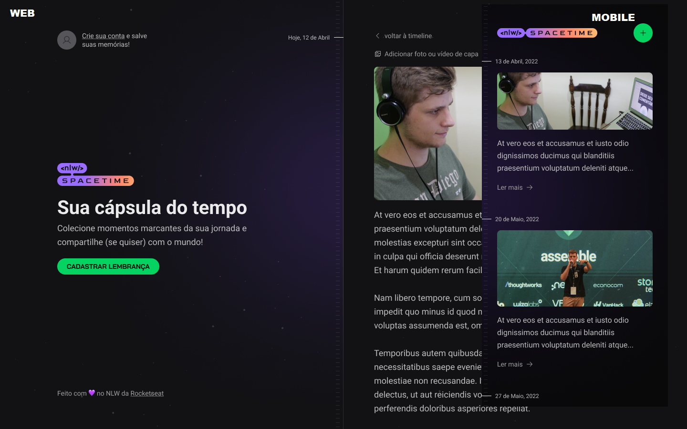

# 🪐📷 NLW Spacetime

  

## :rocket: Tecnologias

Esse projeto foi desenvolvido com as seguintes tecnologias:

- [React](https://pt-br.reactjs.org/)
- [React Native](https://reactnative.dev/)
- [TypeScript](https://www.typescriptlang.org/)
- [Tailwind CSS](https://tailwindcss.com/)
- [Expo](https://docs.expo.dev/)
- [Prisma + SQLite](https://www.prisma.io/)
- [ESLint](https://eslint.org/)
- [PrettierTailwind](https://tailwindcss.com/blog/automatic-class-sorting-with-prettier)
- [NextJs](https://nextjs.org/docs)

## :computer: Projeto

Aplicação de recordação de memórias, onde o usuário poderá adicionar à uma timeline textos, fotos e vídeos de acontecimentos marcantes da sua vida, organizados por mês e ano.

## :label: Layout

Você pode visualizar o layout do projeto através [desse link](https://www.figma.com/community/file/1240070456276424762). É necessário ter conta no [Figma](https://figma.com) para acessá-lo.

## :notebook: Sumário
- [Tecnologias](#rocket-tecnologias)
- [Projeto](#computer-projeto)
- [Layout](#label-layout)
- [Créditos](#tada-créditos)

## :tada: Créditos

A ideia do app fazia parte da [Rocketseat](https://www.rocketseat.com.br/) dentro de um evento chamado NLW Spacetime

## 📝 Licença

Esse projeto está sob a licença MIT. Veja o arquivo [LICENSE](LICENSE) para mais detalhes.

---

Feito com 💜 by Rocketseat :wave: [Participe da comunidade!](https://discordapp.com/invite/gCRAFhc)
